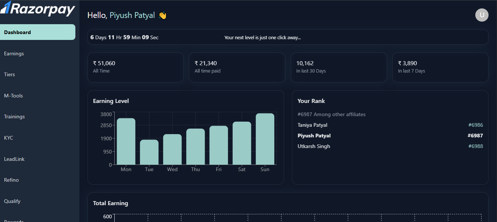

# Razorpay Dashboard (Assignment)

This project is a **static dashboard UI** built using **React, Vite, Tailwind CSS, and Material UI (MUI)**.  
The goal was to replicate the given dashboard design with a sidebar, header, cards, and charts — **no navigation or backend functionality** (purely UI).

---

## Tech Stack

- **React (with Vite)** → Fast frontend development
- **Tailwind CSS** → Utility-first styling
- **Material UI (MUI)** → For some pre-built UI components
- **Recharts** → For charts & graphs

---

## Project Setup

### 1. Create Vite + React Project

```bash
npm create vite@latest razorpay-dashboard
cd razorpay-dashboard
npm install
```

---

### 2. Install Dependencies

```bash
npm install -D tailwindcss @tailwindcss/postcss autoprefixer
npm install @mui/material @mui/icons-material recharts
```

---

### 3. Initialize Tailwind

If `npx tailwindcss init -p` fails, manually run:

```bash
node ./node_modules/tailwindcss/lib/cli.js init
```

This creates `tailwind.config.js`.

---

### 4. Configure Tailwind

Update **`tailwind.config.js`**:

```js
export default {
  content: ["./index.html", "./src/**/*.{js,ts,jsx,tsx}"],
  theme: {
    extend: {},
  },
  plugins: [],
};
```

---

### 5. Configure PostCSS

Add **`postcss.config.js`**:

```js
export default {
  plugins: {
    "@tailwindcss/postcss": {},
    autoprefixer: {},
  },
};
```

---

### 6. Import Tailwind in CSS

Inside **`src/index.css`**:

```css
@import "tailwindcss";
```

---

## Project Structure

```
razorpay-dashboard/
 ┣ src/
 ┃ ┣ components/
 ┃ ┃ ┣ Sidebar.jsx
 ┃ ┃ ┣ Header.jsx
 ┃ ┃ ┣ Card.jsx
 ┃ ┃ ┗ Chart.jsx
 ┃ ┣ App.jsx
 ┃ ┗ index.css
 ┣ tailwind.config.js
 ┣ postcss.config.js
 ┗ package.json
```

---

## Features

- Sidebar with static items (Dashboard, Earnings, Customers, Products, Reports, Settings)
- Top header with search & profile
- Stats cards (Revenue, Transactions, etc.)
- Charts using **Recharts**
- Responsive layout with Tailwind Grid/Flex utilities

---

## Run Project

```bash
npm run dev
```

Project runs at:  
`http://localhost:5173`

---

## Notes

- This dashboard is **completely static** (no routing or backend).
- Focus was on **UI replication**, responsiveness, and clean code.
- Tailwind was configured manually due to issues with `npx tailwindcss init`.

---

## Demo Screenshot


